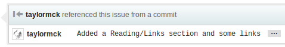

Git/Github Usage
================
######Forking a repository
Unless you're the owner or a collaborator of a repository,
you won't be able to modify it directly.
In order to add your own changes, you'll need to make a *fork*.
With your own fork, you'll be able to read, write, and push changes.
To fork a repository on Github,
go to any of the project's pages and click the Fork button on the top right.
This will create your own copy of the repository.

  
The Fork button

Now you can clone your new fork and get to work.
You can create branches, make changes, make commits, and push the changes
back to Github.
For now, your changes will only affect your repository, not the original.

######Getting the latest code from the original
Once you've done some work with a fork,
you may want to have the owner of the original repository take a look at it,
maybe even integrate it.
We do this using a Pull Request.
First thing's first, you'll need to add the original repository as a remote.
This can be done using the following command.

`git remote add upstream [original repository's url]`

From there, we need to pull down any work that's been done since you last
synced with the original.
This can be done with a simple fetch.

`git fetch`

Next, we need to merge in the changes.
We'll do this using the rebase command instead of merge.
This will often help us avoid merge conflicts and will keep our history cleaner.
You can read more about rebase in
[The Magical and Not Harmful Rebase](http://jeffkreeftmeijer.com/2010/the-magical-and-not-harmful-rebase/).
You'll want to rebase from the latest stable code, which is usually the `develop` branch.
If the original doesn't have a `develop` branch, you may have to use `master`.
When in doubt, check the original repository's readme or ask the owners what branch to use.
The command will look like this.

`git rebase develop`  
Remember that you may need to rebase from a branch other than develop

The rebase command will go one commit at a time.
If there are any merge conflicts along the way,
the rebase will stop until you've resolved them.
Once resolved, you can continue the rebase using

`git rebase --continue`

######Creating a Pull Request
Now that you've got the latest code from the original,
test to make sure that you're changes are still working correctly.
Commit and push when you're ready,
then go on back to your fork's page on Github.
Select the branch whose changes you want to upload,
then click the Compare and Review button.

  
The Compare and Review button

This will bring up a page where you can review your changes and create a pull request.
You may view the diff of every file changed and a list of commits.
Click the Create Pull Request area and you will given some text areas where you
may fill in a title and summary of the pull request.
Click the Send Pull Request button to the this pull request to the original repository.

<!-- TODO add createPullRequest and sendPullRequest images -->
  
The Create Pull Request button

  
The Send Pull Request button

In the original repository, you will find that your pull request has been added
as an issue.
The owner of the original repository may now review your changes.
The pull request also acts as a thread,
and they may comment on it and discuss your changes with you.
Once they are satisfied, they may merge your pull request into the original.
Remember, whether they accept your code or not is up to them.

######Tagging Issues and Other Users
On Github, in pretty much any text area you can type in, you can link to issues
of the current directory.
This makes histories easier to read, and can keep the status of issues up to date.
You simply put a pound sign and the number of the issue.
If the message includes one of the words fixes, fixed, close, closes, or closed,
then the numbered issue will be closed automatically.
If automatically closing more than one issue, you must say one of the magic words
again before each issue number.
The issue's thread will be updated to show that it was referenced.
You can also tag other Github users by using the at sign followed by their name.
This will send them a notificaton and a link to the thread.
This can be done in an other issues, pull requests, and commit messages.
Informally, the process may look something like this

`git commit -am "Fixed #14"`  
This will automatically close issue 14 when pushed to Github

<!-- TODO -->
Here's an example of a commit referencing an issue in this very repository.
  
The commit message references an issue.

  
The issue thread now contains a notification that is was referenced.

Feel free to look at the actual
[commit message](https://github.com/taylormck/ExampleRepository/commit/569929599ac821a90504e41c18c03d9fe17c4792)
and
[issue thread](https://github.com/taylormck/ExampleRepository/issues/16).
