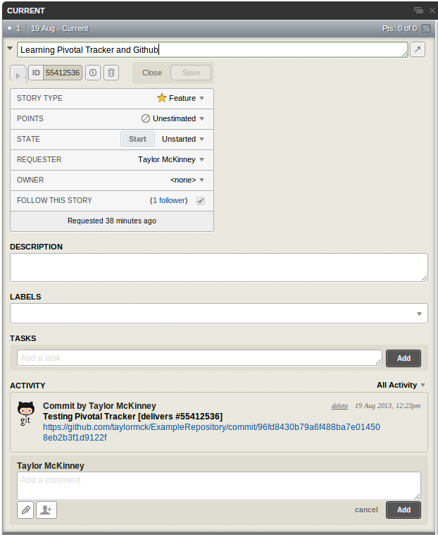

Pivotal Tracker
===============
The repository now has a
[Pivotal Tracker project]
(https://www.pivotaltracker.com/s/projects/894000).
It is public and you may view it all you like.

######Setting Up Pivotal Tracker
Create and verify an account on Pivotal Tracker.
Go to your profile page and scroll to the bottom.
Click the CREATE NEW TOKEN button.
We will need this token later.

  
Create a new token here

Create a new project and add a new story.
Use whatever settings you like.
Once created, view the settings to find the id.

  
The id can be found here

Go to your repositories page.
In settings, look up service hooks.

  
The Navigation List

On the Service Hooks page, scroll down and click Pivotal Tracker.
Paste the token you created earlier into the text field labeled token.
If you like, give the hook a branch to track as well.

Now, make some change to the code base and commit.
Make sure the commit message contains the text
`delivers #[story id]`.
The story id can be found in the stories details on Pivotal Tracker.

The story will update when the commit is pushed.
It will contain the commit message and a link to the commit page on Github.
