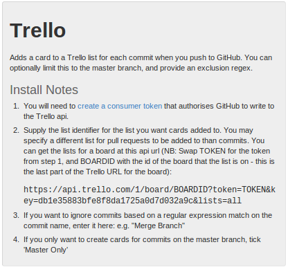
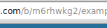

Trello
======
This repository now has a Trello board.  
[Example Repository board on Trello](https://trello.com/b/m6rhwkg2/example-repository)  
All commits and pull requests will automatically create cards on the Trello board.
This is particularly useful implementation of a Kanban board.
All work done is added to the board for quick review.

######Setting up Trello
First, you will need to create an account on Trello.  
Second, create the board you want to use.  
Third, create the lists you want to push cards on for commits and pull requests.  

Lastly, you will need to set up the service hook for your repository.
Go to your repository's settings page.
On the navigation list to the left, click Service Hooks.
On the service hooks page, scroll down the list and click Trello.
You will now see a few text fields, some check fields, and an install notes section.

  
The navigation list

  
Trello Install Notes

Under install note 1, you will see a link that says "create a consumer token".
Open this link in a new tab, accept, and copy the token it gives you.

Under install note 2, you will see an incomplete url.
You will need to copy and paste this url.
You must replace TOKEN with the token we got from install note 1.
Replace BOARDID with the board id from the board's url.
Upon opening the new url, you will have a json file with all the board's
lists and their id's.
Copy the desired id's into the corresponding text fields.

  
The Board ID in the URL

Apply the settings, and you're done.
Now all commits and pull requests will create cards on Trello.
